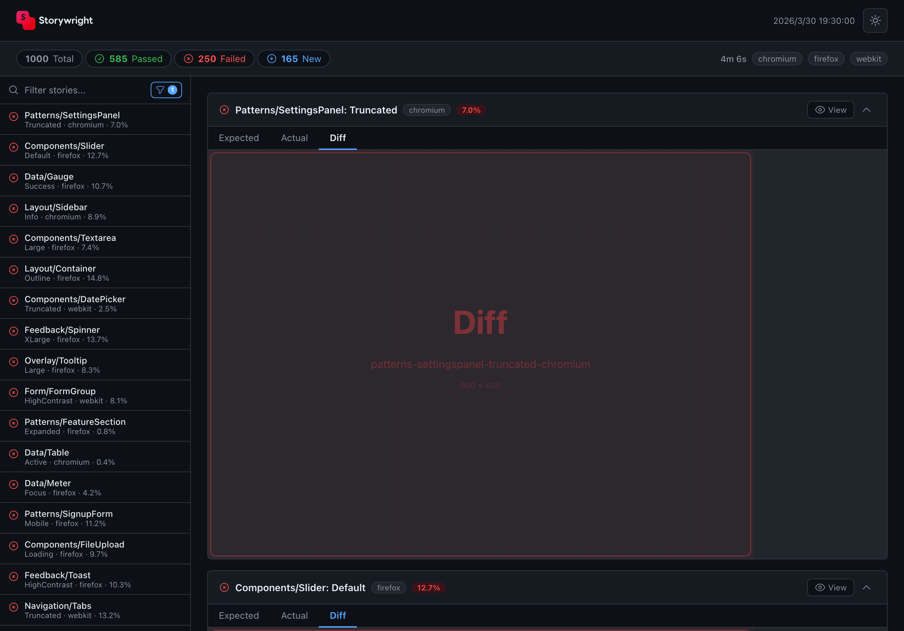

# @storywright/report

<p>
  <a href="https://www.npmjs.com/package/@storywright/report"></a>
  <a href="https://github.com/macloud-developer/storywright/blob/main/LICENSE"></a>
</p>

> HTML report viewer for [Storywright](https://github.com/macloud-developer/storywright)

Svelte-based single-file HTML report that visualizes visual regression test results. Automatically generated by `@storywright/cli`.

## Features

- **Image comparison** — Switch between Expected / Actual / Diff views
- **Type filtering** — Filter by Pass, Diff, or New
- **Browser filtering** — Multi-select when testing across multiple browsers
- **Text search** — Search by story name or variant
- **Virtual scrolling** — Handles thousands of entries efficiently
- **Light / Dark theme** — Respects system preference with manual toggle
- **Review tracking** — Mark entries as viewed

## Screenshot



## How It Works

This package is consumed internally by `@storywright/cli`. The CLI's Playwright reporter:

1. Collects test results and screenshot attachments
2. Writes `summary.json` with all test entries
3. Embeds this package's JS bundle into `index.html`
4. The report initializes from `window.__STORYWRIGHT_SUMMARY__`

The output is a self-contained HTML file — no server required.

## Test Entry Types

| Type     | Icon | Description                                                            |
| -------- | ---- | ---------------------------------------------------------------------- |
| **pass** | ✓    | Screenshot matches baseline                                            |
| **diff** | ✗    | Screenshot differs from baseline — shows Expected / Actual / Diff tabs |
| **new**  | +    | No baseline exists — shows Actual tab only                             |

## Usage

This package is automatically used by `@storywright/cli`. No manual installation is needed.

```bash
# Run tests and generate report
npx storywright test

# Open generated report
npx storywright report --open
```

To merge multiple shard reports:

```bash
npx storywright report --merge --from "shard-*/report/summary.json"
```

## Development

```bash
pnpm install
pnpm --filter @storywright/report dev   # Start dev server
pnpm --filter @storywright/report build # Build IIFE bundle
```

## License

MIT
